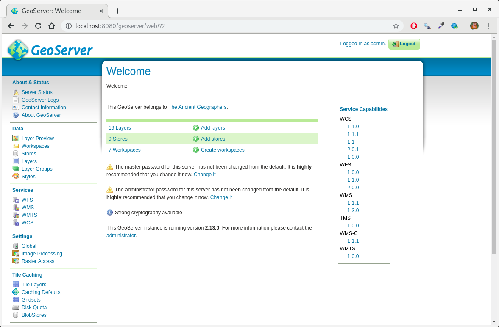
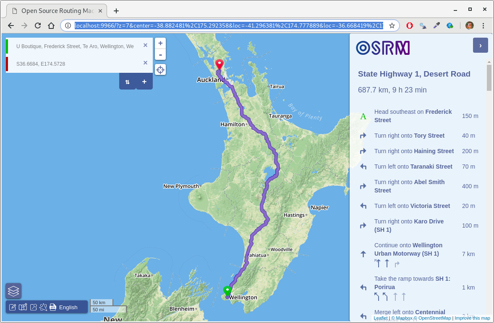
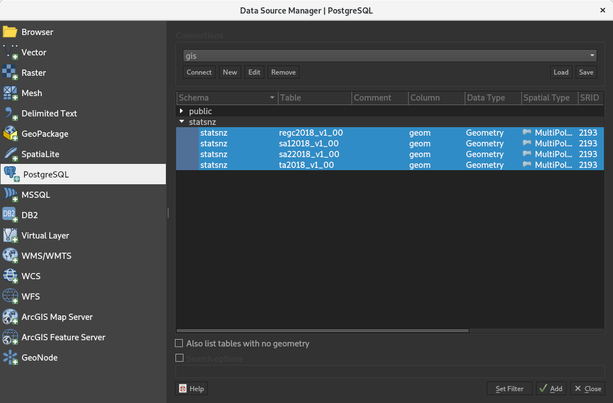
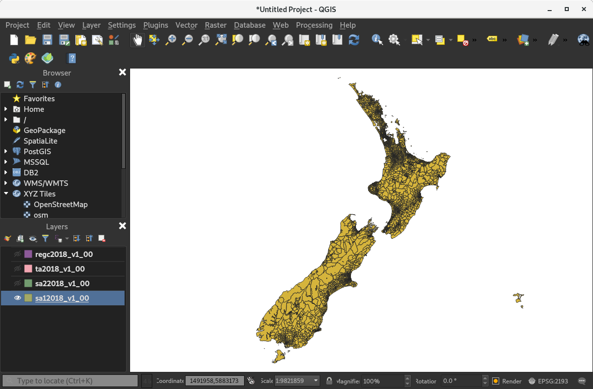

# Geospatial Docker Demos

## Geoserver

The `geoserver` directory contains a basic containerised geoserver.  It can be built via (use whatever tag you like, of course):

```bash
docker build -t cmhh/geoserver geoserver
```

Once built, it can be run via something like:

```bash
docker run -d --name geoserver -p8080:8080 cmhh/geoserver
```

The service will take a minute to get up and running completely, but when done a web interface can be accessed by visiting [localhost:8080/geoserver](http://localhost:8080/geoserver/index.html).  The default username is `admin`, and the password is `geoserver`.  Geoserver has excellent [online documentation](https://docs.geoserver.org/).




## Open Source Routing Machine

The `osrm` folder contains a containerised instance of [Open Source Routing Machine](http://project-osrm.org/) which has been pre-populated with New Zealand data and assumes left-side driving, as is appropriate.  To build the container run:

```bash
docker build -t cmhh/osrm-backend-nz osrm-backend-nz
```

Once built, the routing service can be started via:

```bash
docker run -d --name osrm-backend-nz -p5000:5000 cmhh/osrm-backend-nz
```

Once running, API calls can be made via `http://localhost:5000/osrm/{service}/{version}/...`.  Again, there is excellent [online API documentation](http://project-osrm.org/docs/v5.15.2/api/#general-options). 

If your primary interest is calculating the route between two points, there is a Docker image available which provides a nice web-based front-end.  This can be fetched and run (assuming the backend service is running) via:

```bash
docker pull osrm/osrm-frontend
docker run -d --name osrm-frontend -p 9966:9966 -e OSRM_BACKEND='http://localhost:5000' osrm/osrm-frontend
```

If you have Docker compose installed, a simple compose script is also provided as `osrm/docker-compose.yml`.  To simultaneously start the backend and frontend, simply run:

```bash
# start the services 
cd osrm && docker-compose up
# stop the services 
docker-compose down
```

The frontend can be accessed via [http://localhost:9966](http://localhost:9966/?z=7&center=-38.882481%2C175.292358&loc=-41.296381%2C174.777889&loc=-36.668419%2C174.572754&hl=en&alt=0)





## PostGIS Database

The `postgisdemo` folder contains a containerised PostgreSQL instance containing a PostGIS database with a handful of Stats NZ geographic boundaries pre-loaded.  These are loaded on startup from shapefiles via the `shp2pgsql` command.  To build the container run:

```bash
docker build -t cmhh/postgis postgis
docker build -t cmhh/postgisdemo postgisdemo
```

Note this does not represent best practice with regards to the use of usernames and passwords, but the data used here isn't sensitive.  To start an instance of the service (assuming you don't already have an instance of Postgres running locally on port 5432) run:

```bash
docker run -d --name gis -p5432:5432 cmhh/postgisdemo
```

You can then access the instance as usual--the database name is `gis`, the schema of interest is `statsnz`, the username is `gisuser`, and the password is `gisuser`.



